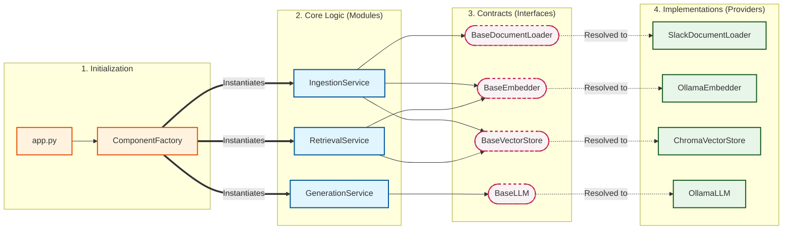
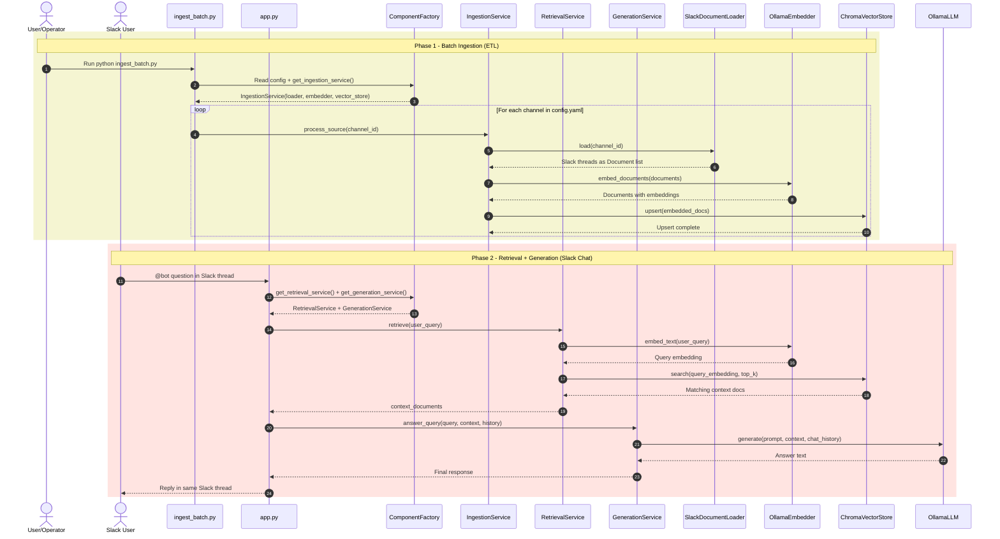

# Slack Knowledge Oracle

[](https://www.python.org/)
[](./CHANGELOG.md)

A modular Slack-native RAG assistant that ingests channel knowledge, stores embeddings in Chroma, and answers team questions inside Slack threads.

The architecture is interface-driven and provider-based, so core business logic remains decoupled from implementation choices.

## Architecture

This project separates system behavior into contracts (interfaces), application modules (business logic), and providers (concrete integrations).



### End-to-End Sequence



## Current Features (v1.0.0)

- Slack channel ingestion with thread-aware context stitching.
- Deterministic document IDs for stable upserts.
- Metadata-rich documents with author and direct Slack message URLs.
- Local embedding and generation through Ollama.
- Local persistent vector index via Chroma.
- Dynamic provider resolution through `ProviderRegistry` decorators.
- Config-driven system behavior through `config.yaml`.
- Slack bot replies in thread to `app_mention` events.
- In-memory per-thread conversation memory for follow-up continuity.

## Directory Structure

```text
slack-knowledge-oracle/
|- app.py
|- ingest_batch.py
|- config.yaml
|- requirements.txt
|- CHANGELOG.md
|- core/
|  |- entities.py
|  |- exceptions.py
|  |- registry.py
|- interfaces/
|  |- document_loader.py
|  |- embedder.py
|  |- llm.py
|  |- vector_store.py
|- modules/
|  |- ingestion/service.py
|  |- retrieval/service.py
|  |- generation/service.py
|- providers/
|  |- __init__.py
|  |- slack/loader.py
|  |- local/ollama_embedder.py
|  |- local/ollama_llm.py
|  |- chroma/vector_store.py
|- factories/
|  |- component_factory.py
`- config/
   `- settings.py
```

## Getting Started

### 1. Prerequisites

- Python 3.9+
- Slack app credentials for bot token and app token (Socket Mode)
- Ollama running locally

Pull the default models used by `config.yaml`:

```bash
ollama pull qwen3:8b-q4_K_M
ollama pull qwen3-embedding:0.6b
```

### 2. Installation

```bash
git clone https://github.com/<your-org>/slack-knowledge-oracle.git
cd slack-knowledge-oracle
python -m venv .venv
# Windows
.venv\Scripts\activate
# macOS/Linux
# source .venv/bin/activate
pip install -r requirements.txt
```

### 3. Configure Environment

Create a `.env` file at project root with:

```env
SLACK_BOT_TOKEN=xoxb-...
SLACK_APP_TOKEN=xapp-...
SLACK_WORKSPACE_DOMAIN=your-workspace-domain
```

### 4. Configure Ingestion Targets

Update `config.yaml` with your Slack channel IDs under:

```yaml
slack:
  target_channels:
    - "C0123456789"
```

### 5. Run Batch Ingestion

```bash
python ingest_batch.py
```

### 6. Run the Slack Bot

```bash
python app.py
```

Mention the bot in a Slack channel thread to query indexed knowledge.

## Runtime Configuration

`config.yaml` controls provider and model choices, retrieval depth, vector store settings, and logging.

Key sections:
- `models.llm`
- `models.embedder`
- `vector_store`
- `slack.target_channels`
- `retrieval.top_k`
- `logging`

## Extending the Project

To add a new provider without modifying module logic:

1. Implement the appropriate interface in `providers/<name>/...`.
2. Add the matching `@ProviderRegistry.register_*` decorator.
3. Import that provider in `providers/__init__.py`.
4. Switch configuration in `config.yaml` (where applicable).

## Notes

- Ingestion currently focuses on Slack channel data.
- Conversation memory in `app.py` is in-process memory and resets on restart.
- Advanced reranking and long-term memory backends are not yet implemented in v1.
